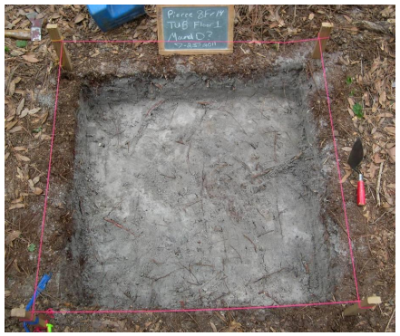

# ENVIRONMENTAL CONCERNS
- Compare the wetland areas of the map and the LiDAR, the water level may be slowly shifting closer to the Mound Complex.
- This change could be based on high/low tides, the season the LiDAR images were taken in, or when the field work was completed for the archaeological survey of the mounds.
- Continually utilizing LiDAR can help us keep an eye on this area and any potential environmental changes that might put the site at risk. 
- Global warming puts many coastal sites at risk, and we want to protect all of them!

[Learn more about global warming here!](video.html)

# WHY IS IT IMPORTANT
After looking through our project we hope you can see why LiDAR is so important to archaeologists. 
- It helps us uncover sites you might not be able to see from satellite imagery with lots of vegetation.
- We can use it to study _huge_ areas of land that would take a lot of time to survey just by walking. 
- Using LiDAR can help us remotely study and watch a site over time, to make sure it's always protected and we document any potential environmental changes. 

# WE HOPE YOU LEARNED MORE ABOUT ARCHAEOLOGY AND REMOTE SENSING!

###### White (2013)

###### Sources
###### Florida Division of Emergency Management. 2007 Florida Division of Emergency Management (FDEM) Lidar Project: Franklin County. Charleston, SC. NOAA's Ocean Service, Office for Coastal Management (OCM).
###### White, Nancy. 2013	Pierce Mounds Complex: An Ancient Capital in Northwest Florida. Final Report to George J. Mahr, Apalachicola, Florida. University of South Florida. 

[BACK](UsingLiDAR.md)
