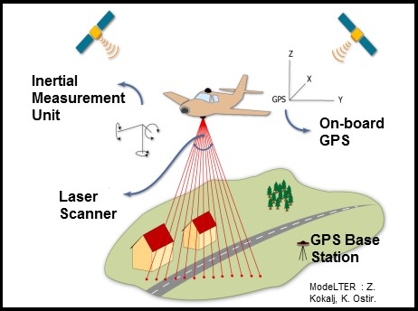

# WHAT IS REMOTE SENSING?
- Remote sensing uses technology to remotely find and study the enviornment.
- By scanning the environment with lasers, data is collected about the landscape below (the laser measurement is based on how quickly light is bounced back to the system)
- LiDAR (Light Detection and Ranging) is one way to gather aerial images of the landscape.
- We can use remote sensing to gather information from large areas that may be difficult to study from the ground.
- Archaeologists can use remote sensing and LiDAR to find historic homesteads or foundations, old field furrows, mounds, or other earthworks.
- When studying aerial data things like vegetation or buildings can be removed so we can see the ground clearly.

# OUR PROJECT
- We want to look at one particular archaeological site in northwest Florida. 
- The site is already known, but is hidden away in a densely vegetated area just south of a wetland on private property. 
- With LiDAR we can take a look at the area to check on the site, to make sure nothing has affected it.

## [CLICK HERE](piercemoundmap.html) to try and find the site we will be looking at! 

[BACK](index.md) [NEXT](PierceMounds.md)
