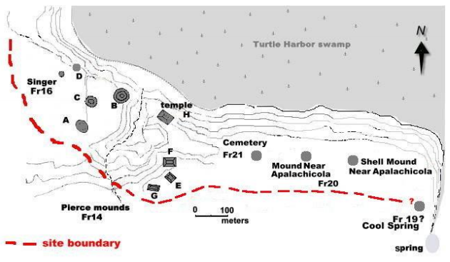

# A CLOSER LOOK
- After finding areas of potential interest on our main maps of the site, we wanted to take a closer look to ensure we really were seeing distinct changes in elevation. 
- To do this we cropped our map to focus on each potential mound. 
- We followed the 2007 map of Pierce Mound to identify each mound. 

##### Mound A (left)                and                      Mound B        (right)          

                                    

##### Mound C (left)            and           Mound G, E, and F (right)

                    

##### Temple H        and Mound D

        

## But what about this mound? A different site!

While most of the mounds in this area are considered part of the Pierce Mound Complex, but based on previous survey of the area

[BACK](UsingLiDAR.md)   [NEXT](Conclusions.md)
