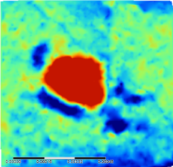
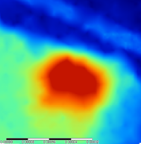
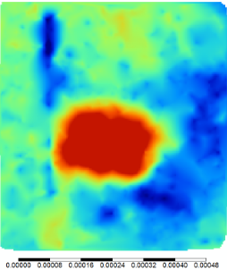
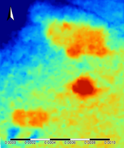
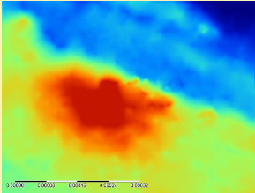
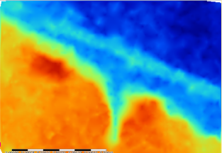
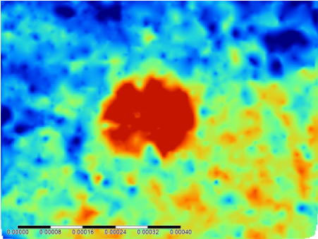

# A CLOSER LOOK
- After finding areas of potential interest on our main maps of the site, we wanted to take a closer look to ensure we really were seeing distinct changes in elevation. 
- To do this we cropped our map to focus on each potential mound. 
- We followed the 2007 map of Pierce Mound to identify each mound. 

##### Mound A

##### Mound B

##### Mound C

##### Mound D, E, and ?

##### Temple

##### Fr16 

## But what about this mound?

[BACK](UsingLiDAR.md)
