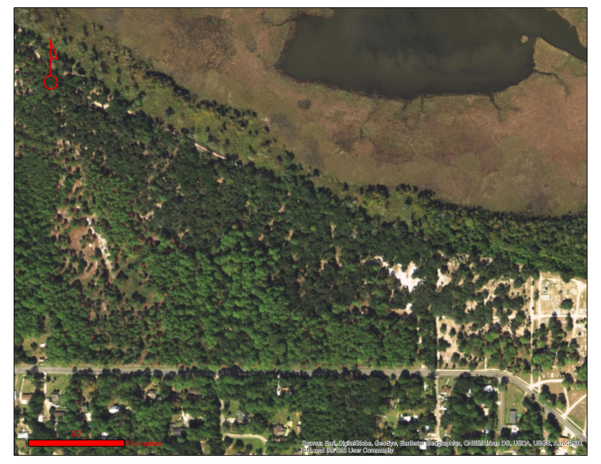

# PREHISTORIC FLORIDA
- People have been builidng mounds in Florida since the Middle Woodland (A.D. 250 - 750).
- Mounds could be used as an eleveted area for temples or houses or they could have been for burials, territorial markers, or simply garbage piles.
- They were often created in layers of sand and shell.
- The Middle Woodland period was marked by an increase in trade goods from areas outside the southeastern United States. 

### This is the location of the site we will be looking at specifically.

# PIERCE MOUNDS
- Intial surveys in the early 1900s suggested there were 10 mounds at this site, but continued survey suggests even more mounds were built here.
- Close to Turtle Harbor, the Apalachicola River, and the Apalachicola Bay makes this location in the middle of a lot of great resources like oysters and fish.
- The mounds at this site are unique because they are spilt between flat platform mounds and rounded circle mounds.
- The site is dated to the Woodland and Fort Walton Period, and was likely occupied for 2000 years. 
- In 2007 researchers were able to create a map of the area, labeling the mounds of the Pierce Site, as well as a few other potential sites nearby. 

### The first map drawn of Pierce Mounds in 1902.

### A later map drawn of Pierce Mounds in 1959.

### The most current map of Pierce Mounds from 2007.

