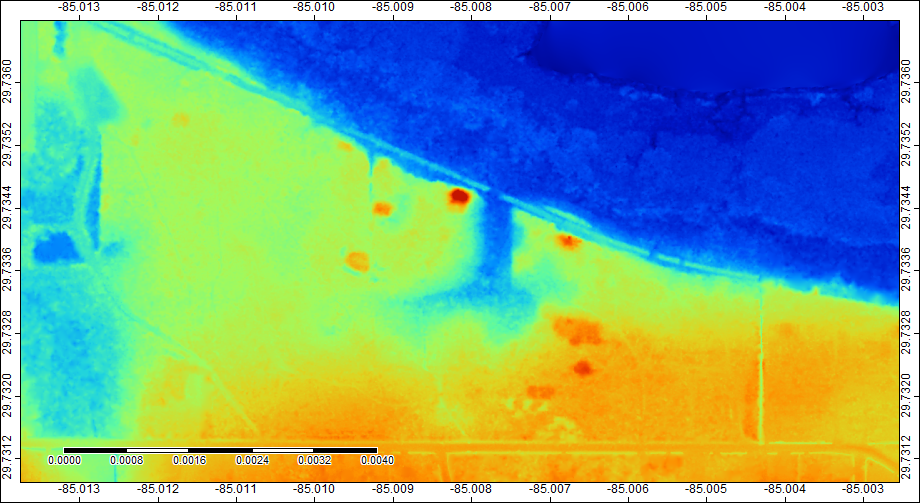

# THE DATA
- We gathered our LiDAR data from the open access National Oceanic and Atmospheric Administration (NOAA).
- The file we downloaded was from the 2007 Florida Department of Emergency Services survey in Franklin County. 
- Our initial point cloud file was covered with vegetation in the area we wanted to survey, but the wetlands, Harbor, and roads of Apalachicola are easy to pinpoint. 

- Through the magic of editing, we were able to eliminate all low vegetation that was registering within our data file. 
- Removing this gave us a much clearer view of the ground, including the mounds in our area of interest. 
- The **red** indicates areas of high elevation, **blue** indicates areas of low elevation.

### How many mounds can you spot in this image?

- Sometimes it helps to look at LiDAR images different ways, we we created a Hillshade.
- Hillshades show how light heights the landscape, emphasizing areas with shadow and direct sun which can draw our attention to areas of differing elevation. 

### Do you see any other areas of elevation in this image?

[BACK](PierceMounds.md)               [Next](Mounds.md)
