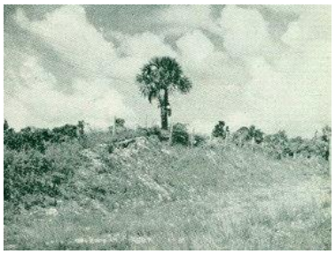
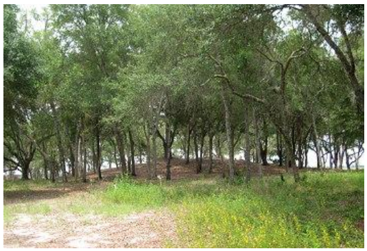
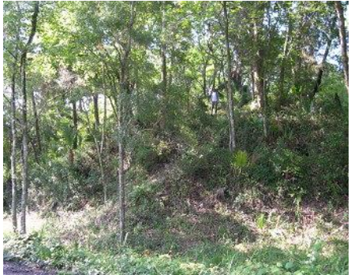
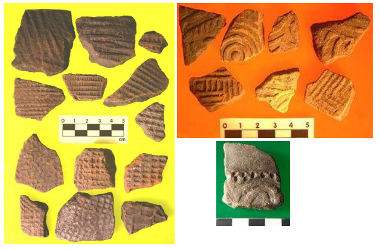

# Welcome to Pierce Mounds

## This is a prehistoric mound site in northwest Florida that was documented over 100 years ago.

White (2013)

## There are multipile mounds that make up the site. 

White (2013)

White (2013)

## The site has been excavated in the past, uncovering many artifacts.

White (2013)

## We want to utilize new technologies to study the site even further. 

[CHECK OUT OUR PROJECT](Introduction.md)
